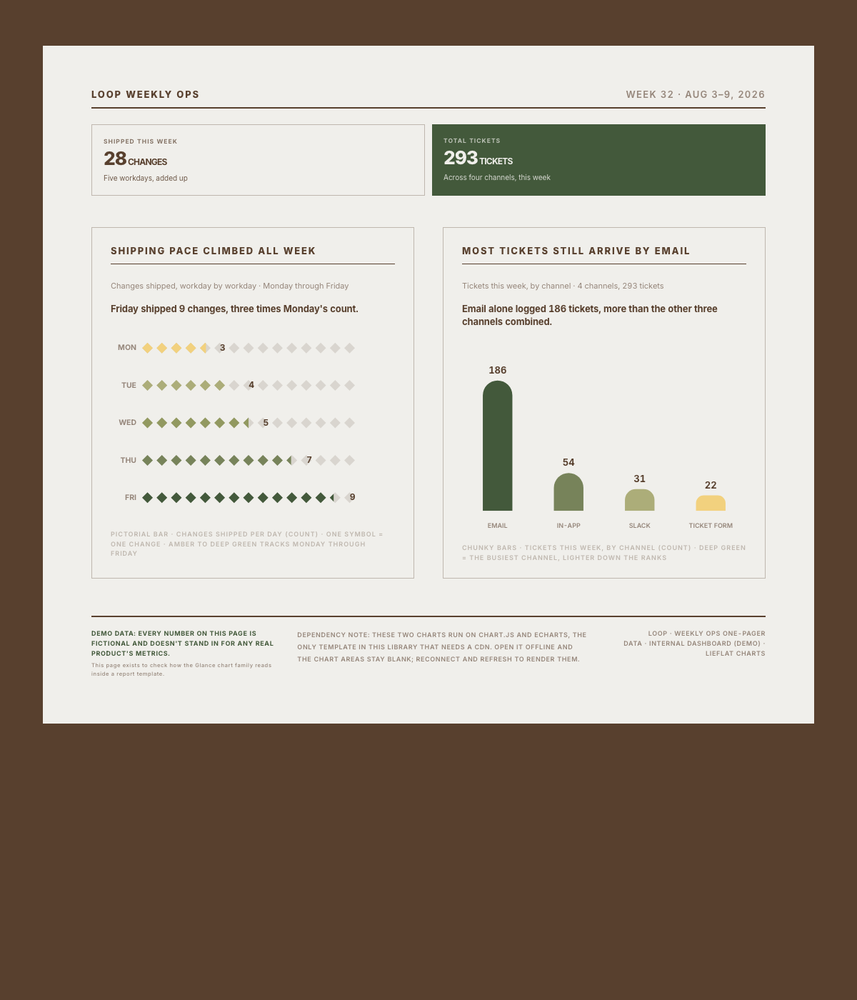

# Navi Chart

English | [中文](README.zh.md)

[](https://github.com/linm1/lieflat-charts)

Navi Chart is an Agent Skills-compatible data visualization and report-generation skill for Claude Code, Codex, and other AI agents that support `SKILL.md`. It is a fork of [`lieflat-charts`](https://github.com/larashero3-dotcom/lieflat-charts), originally created at [moxt.ai](https://moxt.ai) — see [`PROVENANCE.md`](PROVENANCE.md) for exactly what this fork changes and why, and [`docs/design-language/RESEARCH.md`](docs/design-language/RESEARCH.md) for the evidence-based research behind those decisions. By default it produces polished charts; it switches to one of 12 full-page templates, each available in Chinese and English, only when the user explicitly asks for a report, annual report, monthly report, white paper, poster, brief, or similar narrative deliverable.

Its visual language is built around consistent typography, spacing, line work, and motion. It includes three main chart families:

- **Lupi Editorial**: fine lines, dot fields, record-level detail, annotations, and generous whitespace for papers, long-form articles, annual reports, and slow-reading data stories.
- **Glance**: bold bars, large numbers, blocks, and clear ranking for reports, dashboards, and situations where readers need the answer in seconds.
- **Lupi Basics**: familiar bar, line, area, donut, and scatter silhouettes rebuilt with countable units, hairlines, and editorial typography.

The skill also includes standalone interactive visualizations for networks, paths, and dense multi-segment flows. Each chart aims to preserve honest data units while treating headlines, annotations, sources, and page structure as part of the visualization.

Mono is the reliable fallback, but color does not require an explicit user request. The agent can choose automatically between Mono, Porcelain, Palm, and Wire based on the data structure and publishing context; when the fit is unclear, it returns to Mono. When users provide brand colors or exact values, the skill can build one custom palette. One HTML file or chart set uses one color system only while preserving structure, contrast, and data meaning.

## Growing the catalog in plain language

The catalog isn't frozen at its current chart types. Describe a chart shape in conversation — a reference image, or just "I need something like X but for Y" — and the agent finds the nearest existing chart type and either builds a one-off translation from it, or, once that shape proves reusable, promotes it into the catalog with `npm run new-chart`. A promotion is scaffolded from its nearest sibling's real structure (never a blank template) and has to pass the same validation every native chart type passes before it's accepted — so the catalog can grow from real usage without diluting the visual grammar that makes 64 different chart types still feel like one family. The full mechanism, including the exact command, lives in [`SKILL.md`](SKILL.md) §6.2.

## Preview

Representative templates from each chart family.

### Lupi Editorial

Detailed, record-level, and editorial. Selected examples from 20 narrative templates.

<table>
  <tr>
    <td width="50%"></td>
    <td width="50%"></td>
  </tr>
  <tr><td colspan="2"></td></tr>
</table>

### Glance

Fast reading, pre-aggregated information, and conclusion-first composition. Selected examples from 22 Glance templates.

<table>
  <tr>
    <td width="50%"></td>
    <td width="50%"></td>
  </tr>
  <tr><td colspan="2"></td></tr>
</table>

Motion preview:

<p align="center"></p>

More motion examples:

<table>
  <tr>
    <td width="33%"><br><strong>Fifty markets</strong></td>
    <td width="33%"><br><strong>Eight products race</strong></td>
    <td width="33%"><br><strong>H1 revenue</strong></td>
  </tr>
</table>

### Lupi Basics

Familiar chart forms built from countable visual units. Selected examples from 17 foundational templates.

<table>
  <tr>
    <td width="50%"></td>
    <td width="50%"></td>
  </tr>
</table>

### Interactive

For networks, paths, and high-density relationship data.

Motion preview:

<p align="center"></p>

[Open the Force Graph template to try dragging and zooming](https://larashero3-dotcom.github.io/lieflat-charts/templates/big-force.html)

## Color Mode

The skill can automatically choose Mono or one color preset from the data structure and publishing context; users do not need to request color first. Porcelain suits ordered or single-series data, Palm suits a small number of unordered categories, and Wire suits a restrained composition with one focal point. When the fit is unclear, the skill returns to Mono. Users who provide brand colors or exact values can use one custom palette. Each HTML file or chart set still locks one color system, with contrast, hierarchy, and data meaning checked after every change.

#### Porcelain

A single-hue blue scale for ordered data and single-series charts.

<p align="center"></p>

<p align="center"></p>

<table>
  <tr>
    <td width="50%"><br><strong>Basics</strong></td>
    <td width="50%"><br><strong>Glance</strong></td>
  </tr>
  <tr><td colspan="2"><br><strong>Lupi Editorial</strong></td></tr>
</table>

#### Palm

A low-saturation green and yellow family for a small number of unordered categories.

<p align="center"></p>

<p align="center"></p>

<table>
  <tr>
    <td width="50%"><br><strong>Basics</strong></td>
    <td width="50%"><br><strong>Glance</strong></td>
  </tr>
  <tr><td colspan="2"><br><strong>Lupi Editorial</strong></td></tr>
</table>

#### Wire

A black and gray palette with one fluorescent orange focal point.

<p align="center"></p>

<p align="center"></p>

<table>
  <tr>
    <td width="50%"><br><strong>Basics</strong></td>
    <td width="50%"><br><strong>Glance</strong></td>
  </tr>
  <tr><td colspan="2"><br><strong>Lupi Editorial</strong></td></tr>
</table>

## Report Mode

Alongside individual charts, the skill can generate complete HTML reports. The 12 full-page templates are available in Chinese and English for research reports, research briefs, business data reports, financial and economic analysis, product records, dashboards, posters, and personal datasets such as sports, travel, and yearly life logs. Template names describe the layout's character, not a hard use-case restriction; the same layout can move across report types when the information structure fits.

<table>
  <tr>
    <td width="25%"><br><strong>R03 · Annual Data Report / Poster</strong></td>
    <td width="25%"><br><strong>R09 · Business Data / Financial Dashboard</strong></td>
    <td width="25%"><br><strong>R12 · Periodic Data Brief / Monitoring Summary</strong></td>
    <td width="25%"><br><strong>R08 · Population / Socioeconomic One-Pager</strong></td>
  </tr>
  <tr>
    <td width="25%"><br><strong>R01 · Research Report / One-Pager</strong></td>
    <td width="25%"><br><strong>R05 · Project / Product Impact Story</strong></td>
    <td width="25%"><br><strong>R10 · Personal Data / Sports / Travel Record</strong></td>
    <td width="25%"><br><strong>R07 · Research / Market Data Collage Poster</strong></td>
  </tr>
  <tr>
    <td width="25%"><br><strong>R02 · Annual Review / Performance Recap</strong></td>
    <td width="25%"><br><strong>R11 · Research / Financial Brief Card</strong></td>
    <td width="25%"><br><strong>R04 · Monthly Business / Financial Report</strong></td>
    <td width="25%"><br><strong>R06 · Long-Cycle Product / Business Almanac</strong></td>
  </tr>
</table>

## Quick Start

### Install

```bash
npx skills add https://github.com/linm1/lieflat-charts --skill navi-chart
```

You can also send the following instruction to an AI agent with shell access:

```text
Install navi-chart. Clone https://github.com/linm1/lieflat-charts
to ~/.claude/skills/navi-chart, then verify that SKILL.md, templates/,
catalog.md, and mono-tokens.js are present.
```

For Codex, replace the installation path with `~/.codex/skills/navi-chart`.

To update an existing installation:

```text
Update navi-chart. Enter ~/.claude/skills/navi-chart, run git pull,
and report the latest commit.
```

After installation, ask your agent:

```text
Turn this research dataset into five charts for a long-form article.
Compare Lupi Editorial and Lupi Basics first. Use Glance only if neither group fits.
```

More prompt examples:

```text
Use navi-chart to turn this dataset into a color chart.
```

```text
Read this paper, identify the strongest data findings, and build a complete HTML chart page.
```

```text
This is weekly reporting data. Make the ranking, changes, and anomalies readable within ten seconds.
```

```text
Turn this CSV into a Glance chart suitable for a presentation.
```

```text
Redesign this dataset in the Lupi style, preserving every real record and adding useful annotations.
```

```text
Rebuild this chart with the Porcelain preset. Use lightness to represent value without changing the structure.
```

The number of charts follows the number of independent findings: one chart for one question, two or three charts for two or three findings, and four to six charts for a complete article or paper. A single page defaults to no more than six charts, and repeated conclusions are removed rather than added to meet a quota.

## Templates

<!-- GENERATED:chart-family-table:start -->
| Family | Count |
| --- | ---: |
| Glance | 22 |
| Lupi Editorial | 20 |
| Lupi Basics | 17 |
| Maps | 2 |
| Interactive | 3 |
| **Total** | **64** |
<!-- GENERATED:chart-family-table:end -->

| Family | Best for | Implementation |
|---|---|---|
| **Lupi Editorial** | Annual reports, papers, long-form articles, posters, portfolios, and readers willing to inspect detail | Handwritten SVG |
| **Lupi Basics** | Bars, lines, areas, donuts, scatterplots, waterfalls, heatmaps, progress, treemaps, and other foundational data shapes | Handwritten SVG / ECharts |
| **Glance** | Weekly reports, dashboards, monitoring, and presentations that require fast comparison | Chart.js / ECharts |
| **Maps** | US or world choropleths, only on explicit request | ECharts + GeoJSON |
| **Interactive** | Networks, paths, multi-segment flows, and high-density relationship data | ECharts / SVG |

Color presets add 3 families (Porcelain, Palm, Wire) across 18 re-skinned samples, for distinguishing real data dimensions or adding one controlled focal point to monochrome charts. Report templates add 12 full-page layouts, each in two languages, for research, annual, monthly, dashboard, poster, brief, and notebook-style deliverables — all as single-file HTML.

### Lupi Editorial

Each point, line, and annotation should map to a real unit whenever possible. Lupi Editorial does not rush to aggregate the evidence into a single number. It lays out records, distributions, structures, and exceptions through hairlines, whitespace, ledger-like guides, annotations, and low-contrast value scales.

### Lupi Basics

Lupi Basics retains familiar chart silhouettes while rebuilding them inside the same editorial language. A cell can represent one percentage point, a tick can represent one person, a hairline can represent one day, and a treemap rectangle can represent one honest weight. It is suited to smaller datasets that still need density and countable visual units.

### Glance

Glance pre-aggregates information, strengthens the main forms, and places the key ranking or change in the first visual pass. It is not a simplified Lupi mode. It serves a different reading speed: readers can identify what is higher, what changed most, and what needs attention within seconds.

### Interactive

Interactive templates handle relationship data that ordinary static charts cannot carry. Hover, focus, dragging, pinned paths, and status readouts turn complex networks into records that can be queried one by one. Interaction is reserved for real data, not decorative elements.

## Design

Every family shares the same core visual language: paper gray and charcoal at the extremes, a controlled grayscale ladder between them, and data encoded through lightness, position, length, density, and structure. The three color presets provide stable starting points. Explicit brand colors can also become one role-based custom palette. When users refine the palette, contrast, hierarchy, and data meaning still need to remain clear.

Navi Chart differs from a conventional chart generator in more than color:

- It identifies the data contract before choosing a chart.
- Each chart carries one independent conclusion before charts are assembled into a page.
- Real data units become visual atoms instead of using decorative noise to imitate density.
- Headlines, annotations, sources, spacing, and motion are treated as part of the chart.
- Lupi and Glance represent different reading speeds, not simply static versus interactive output.
- The catalog can grow from a natural-language description of a new chart need, through a validated promotion path rather than ad hoc invention — see "Growing the catalog in plain language" above.

## Structure

```text
.
├── README.md                # English project guide (primary)
├── README.zh.md             # Chinese project guide
├── SKILL.md                 # Agent workflow and design rules
├── PROVENANCE.md            # What this fork changes vs. upstream, and why
├── catalog.md                # Data-contract index for 64 chart types (generated from catalog/charts.json)
├── report-catalog.md         # Scenario index for 12 report templates (generated from catalog/reports.json)
├── catalog/                  # Machine-readable chart/report catalog, schemas, and generated token snapshot
├── mono-tokens.js           # Shared monochrome design tokens
├── color-presets.js         # Three built-in color presets
├── templates/               # Lupi, Basics, Glance, interactive, and report templates
│   ├── color/               # Color-restyled samples
│   └── reports/             # 12 report templates, each in Chinese and English
├── assets/geo/               # Vendored map GeoJSON (see docs/design-language/UNKNOWNS.md U2)
├── examples/                # Examples based on public datasets
├── docs/
│   ├── assets/               # README screenshots and motion previews
│   ├── adr/                  # Architecture decision records for this fork
│   └── design-language/      # RESEARCH.md, PRINCIPLES.md — the evidence base for SKILL.md's rules
└── scripts/                   # validate.ts, new-chart.ts, generate-catalog-docs.ts, build-tokens.ts
```

Open the HTML files under `templates/` directly to inspect the galleries. Open `templates/reports/index.html` to browse the report templates and their Chinese/English variants. Report mode chooses a full-page skeleton from `report-catalog.md`, then reuses the real chart implementations indexed in `catalog.md` for each chart slot. Lupi and Basics mainly use native SVG, while F13 Treemap uses ECharts. Glance, Circular, Force, and report templates R11/R12 also load Chart.js or ECharts from a CDN and require an internet connection unless those dependencies are inlined.

## License

This project is licensed under the [PolyForm Noncommercial License 1.0.0](LICENSE) — the same terms as upstream; see [ADR-0001](docs/adr/0001-license-and-provenance.md) for why this fork doesn't relicense. Learning, modification, sharing, and noncommercial use are allowed. Commercial use requires separate permission.

Chart.js, Apache ECharts, and the Inter typeface remain subject to their original licenses. See [THIRD_PARTY_NOTICES.md](THIRD_PARTY_NOTICES.md).
