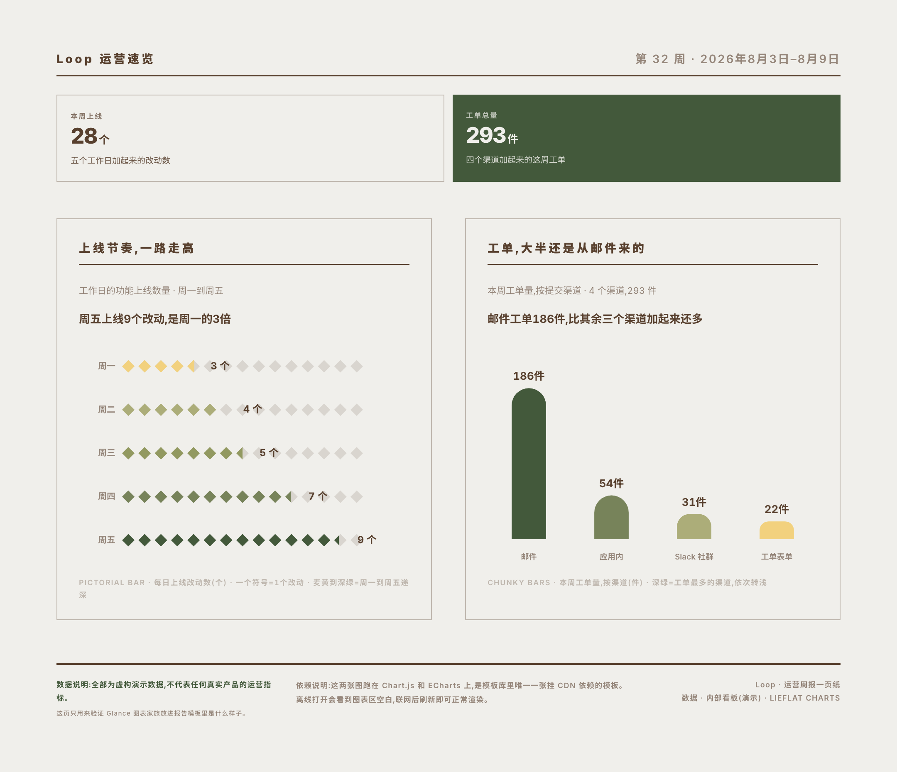

# Lieflat Charts

繁體中文（台灣） | [English](README.md)

> 繁體中文輸出預設採用台灣繁體中文（`zh-Hant-TW`）；除非使用者明確指定，不使用簡體中文。

[](https://moxt.ai/zh-CN/hub?view=skill&id=lieflat-charts)

Lieflat Charts 是一套遵循 Agent Skills 格式的資料視覺化與報告產生 skill，可供 moxt、Claude Code、Codex 及其他相容 `SKILL.md` 的 AI agent 使用。本 skill 在 [moxt.ai](https://moxt.ai) 製作，預設把資料做成有編輯感的圖表；只有使用者明確要求報告、年報、月報、白皮書、海報或 brief 時，才從 12 套繁中與英文整頁範本產生可發布的 HTML 報告。

它以統一的字型、留白、線條和動效建立自己的視覺語法，包括以下幾種視覺風格：

- **Lupi（編輯敘事型）**：用細線、點陣、逐條記錄和大量留白展開資料，強調真實單位、細節和旁註，適合論文、長文、年報與需要慢慢閱讀的資料故事。
- **Glance（快速判斷型）**：用粗柱、大數字、色塊和清晰排序提前聚合資訊，讓讀者幾秒內看懂高低、變化和異常，適合週報、彙報與 dashboard。
- **Basics（基礎編輯型）**：保留柱狀圖、折線圖、環形圖等熟悉輪廓，再用可數刻度、髮絲線和編輯排版增加質感，適合結構簡單或資料量較少的內容。

此外還提供網路、路徑和多段流向等獨立互動大圖。每張圖都儘量保留資料的真實單位，同時讓標題、旁註、來源和頁面結構參與表達。

Mono 黑白灰是穩定的保底方案，同時也有彩色模式，目前支援青瓷藍、椰林綠和編輯部紅三種彩色色系，方便適用各種場景的資料視覺化。Agent 會根據資料結構和使用場景，在 Mono、青瓷藍、椰林綠或編輯部紅之間自動選擇；適用關係不明確時使用 Mono。使用者明確提供品牌色或色值時，也可以建立一套 custom 色盤。同一份 HTML 或同一組圖只使用一種色彩系統，產生後仍可繼續調色，同時保持圖型結構、比例、對比度和資料契約。

## Preview

以下是幾類範本的實際預覽。

### Lupi Editorial

細讀、逐記錄、編輯感。精選 19 張編輯敘事型範本中的代表圖型。

<table>
  <tr>
    <td width="50%"></td>
    <td width="50%"></td>
  </tr>
  <tr><td colspan="2"></td></tr>
</table>

### Glance

快讀、聚合、結論先行。精選 20 張快速判斷型範本中的代表圖型。

<table>
  <tr>
    <td width="50%"></td>
    <td width="50%"></td>
  </tr>
</table>

動態預覽：

<p align="center"></p>

更多動態預覽：

<table>
  <tr>
    <td width="33%"><br><strong>Fifty markets</strong></td>
    <td width="33%"><br><strong>Eight products race</strong></td>
    <td width="33%"><br><strong>H1 revenue</strong></td>
  </tr>
</table>

### Lupi Basics

常見圖型與可數單位的結合。17 張範本覆蓋柱、線、面積、環形、散點、矩形樹圖、直方圖、箱線圖、K 線等基礎資料形狀。

<table>
  <tr>
    <td width="50%"></td>
    <td width="50%"></td>
  </tr>
</table>

### Interactive

用於網路、路徑與高密度關係資料。

動態預覽：

<p align="center"></p>

[開啟 Force Graph 範本體驗拖曳與縮放](https://larashero3-dotcom.github.io/lieflat-charts/templates/big-force.html)

## 新增彩色模式

圖表可以根據資料結構和使用場景自動選擇 Mono 或一套彩色預設，不要求使用者先說「要彩色」。有序單序列可使用青瓷藍，少量無序類目可使用椰林綠，需要一個受控視線落點時可使用編輯部紅；適用關係不明確時回到 Mono。使用者明確給出品牌色或色值時，可以建立一套 custom 色盤。同一份 HTML 或同一組圖只使用一種色彩系統；調整時需重新檢查對比度、視覺主次和顏色所表達的資料意義。

#### Porcelain · 青瓷藍

單色相明度階，適合有序資料和單序列。

<p align="center"></p>

<p align="center"></p>

<table>
  <tr>
    <td width="100%"><br><strong>Basics</strong></td>
  </tr>
  <tr><td colspan="2"><br><strong>Lupi Editorial</strong></td></tr>
</table>

#### Palm · 椰林綠

低飽和綠黃色系，用色相區分少量無序類目。

<p align="center"></p>

<p align="center"></p>

<table>
  <tr>
    <td width="100%"><br><strong>Basics</strong></td>
  </tr>
  <tr><td colspan="2"><br><strong>Lupi Editorial</strong></td></tr>
</table>

#### Wire · 編輯部紅

黑灰階加一個螢光橙視線落點。

<p align="center"></p>

<p align="center"></p>

<table>
  <tr>
    <td width="100%"><br><strong>Basics</strong></td>
  </tr>
  <tr><td colspan="2"><br><strong>Lupi Editorial</strong></td></tr>
</table>

## 最新更新

### 新增報告模式

現在可以在單張圖表之外，直接從 12 套整頁報告範本產生 HTML 報告。每套範本都提供台灣繁體中文版和英文版，涵蓋調查報告、研究簡報、業務資料報告、財報與金融經濟分析、產品記錄、dashboard、海報，以及運動、旅行和年度生活資料記錄等從工作到個人的需求。範本名稱代表版型性格，不是使用場景的限制；同一套範本可以根據資料結構遷移到不同型別的報告。

<table>
  <tr>
    <td width="25%"><br><strong>R03 · 年度資料報告 / 年度海報</strong></td>
    <td width="25%"><br><strong>R09 · 業務資料 / 財務經營 Dashboard</strong></td>
    <td width="25%"><br><strong>R08 · 人群 / 社會經濟資料一頁</strong></td>
    <td width="25%"><br><strong>R12 · 週期資料快報 / 監控摘要</strong></td>
  </tr>
  <tr>
    <td width="25%"><br><strong>R01 · 調查報告 / 研究一頁</strong></td>
    <td width="25%"><br><strong>R05 · 專案 / 產品影響力故事</strong></td>
    <td width="25%"><br><strong>R10 · 個人資料 / 運動 / 旅行記錄</strong></td>
    <td width="25%"><br><strong>R07 · 調查 / 市場資料拼貼海報</strong></td>
  </tr>
  <tr>
    <td width="25%"><br><strong>R02 · 年度回顧 / 業績回顧</strong></td>
    <td width="25%"><br><strong>R11 · 研究 / 金融經濟簡報卡</strong></td>
    <td width="25%"><br><strong>R04 · 月度業務 / 財務經營報告</strong></td>
    <td width="25%"><br><strong>R06 · 長週期產品 / 業務年鑑</strong></td>
  </tr>
</table>

## 零門檻快速使用

### 推薦在 Moxt 中使用

[](https://moxt.ai/zh-CN/hub?view=skill&id=lieflat-charts)

Lieflat Charts 在 [Moxt](https://moxt.ai/zh-CN/hub?view=skill&id=lieflat-charts) 中完成設計、測試和持續迭代。它的設計規則、範本結構與檔案工作流，都是圍繞 Moxt 的 Agent 協作方式反覆打磨的。

因此，在 Moxt 中使用時，Agent 能更順暢地讀取完整的設計規範、理解 Lieflat Charts 的視覺語言、呼叫對應範本，並在同一個工作區中持續預覽和修改結果，更穩定地執行這套設計。

| Lieflat Charts 的工作環節 | 一般的一問一答方式 | 在 Moxt 中 |
|---|---|---|
| 理解設計語言 | 需要從 Skill 檔案重新建立理解 | Skill 已在相同的 Agent 工作環境中完成設計和驗證 |
| 讀取規則、範本和資料 | 通常需要反覆上傳檔案或提供路徑 | 規則、範本、資料和成品可以保留在同一個工作區 |
| 多輪選擇和修改圖表 | 更換對話後可能需要重新說明背景 | Agent 可以沿用工作區中的檔案和上下文繼續修改 |
| 產生最終結果 | 結果可能停留在對話或臨時目錄中 | HTML 成品可以和資料、範本一起留在工作區繼續完善 |

Lieflat Charts 仍然可以安裝到其他支援 Agent Skills 的工具中；Moxt 是它的原生製作環境，也是目前更完整、步驟更短的推薦使用方式。

### 安裝到其他 Agent

一條命令安裝：

```bash
npx skills add https://github.com/larashero3-dotcom/lieflat-charts --skill lieflat-charts
```

也可以直接把這段話發給有 shell 權限的 AI Agent：

```text
幫我安裝 lieflat-charts。請把 https://github.com/larashero3-dotcom/lieflat-charts
複製到 ~/.claude/skills/lieflat-charts，安裝完成後檢查 SKILL.md、templates/、
catalog.md 和 mono-tokens.js 是否存在。
```

使用 Codex 時，將安裝路徑換成 `~/.codex/skills/lieflat-charts`。

已經安裝過的話，用這段話更新：

```text
幫我更新 lieflat-charts。請進入 ~/.claude/skills/lieflat-charts 執行 git pull，
然後告訴我當前最新 commit。
```

安裝後直接對 Agent 說：

```text
把這份調查資料做成適合官方帳號長文的 5 張繁體中文版圖表。
預設先比較 Lupi Editorial 和 Lupi Basics 候選；兩組都不適用時，再使用 Glance。
```

也可以試這些請求：

```text
幫我用 lieflat charts 給這些資料做個彩色風格的圖表。
```

```text
讀這篇論文，找出最值得講的幾個資料結論，做成一頁完整的 HTML 圖表。
```

```text
這是一份週報資料，要求 10 秒內看懂排名、變化和異常。
```

```text
把這個 CSV 做成一張適合放進彙報裡的 Glance 圖表。
```

```text
用 Lupi 風格重新設計這組資料，保留每條真實記錄，並加入必要的旁註。
```

```text
用青瓷藍預設重做這張圖，用明度深淺表示數值大小，不改變原圖的結構。
```

圖數由獨立結論決定：單個問題通常 1 張，兩個到三個結論 2–3 張，完整文章或論文 4–6 張，單頁預設最多 6 張。使用者明確指定數量時會遵守，但不會為了湊數重複表達同一個結論。

## Templates

| 型別 | 數量 | 適合什麼 | 實作 |
|---|---:|---|---|
| **Lupi Editorial** | 15 | 年報、論文、官方帳號、海報、作品集；讀者願意停下來細看 | 手寫 SVG |
| **Lupi Basics** | 13 | 柱、折線、面積、環形、散點、瀑布、熱力、進度、矩形樹圖等基礎資料形狀 | 手寫 SVG / ECharts |
| **Glance** | 18 | 週報、dashboard、監控、彙報；需要快速排序和比較 | Chart.js / ECharts |
| **Interactive** | 3 | 網路、路徑、多段流向和高密度關係資料 | ECharts / SVG |
| **Color Presets** | 3 套 / 15 個樣張 | 需要顏色區分資料維度，或為 Mono 加一個受控視線落點 | 以原範本為基礎換膚 |
| **Report Templates** | 12 套 / 繁中／英文雙版 | 調查、年報、月報、儀表板、海報、簡報和個人記錄等完整整頁報告 | 單檔案 HTML |

### Lupi Editorial

把一個點、一根線或一條旁註儘量對應到真實資料單位。它不急著把資料聚合成一個結論，而是把原始資料攤開，讓讀者看到結構、分佈和例外。視覺上使用髮絲線、留白、帳本式導軌、旁註和低對比灰階，閱讀時間通常在 30 秒以上。

### Lupi Basics

保留常見圖表的剪影，但把它們放進 Lupi 的編輯語法裡：一格可以是一個百分點，一根 tick 可以是一個人，一條 hairline 可以是一天，Treemap 的一塊麵積可以對應一個真實權重。它適合資料不多、但仍然希望畫面有密度和可讀單位的場景。

### Glance

提前聚合、加粗主要形狀，把關鍵排序和變化放到第一眼。它不是「精簡版 Lupi」，而是另一種閱讀速度：讀者不需要展開每條記錄，也能在幾秒內知道誰更高、哪裡變化最大、哪個指標需要關注。

### Interactive

用於一般靜態圖承載不了的關係資料。透過 hover、聚焦、拖曳、固定路徑和狀態列，把「看起來很複雜」的網路變成可以逐條查詢的圖。互動只服務於真實記錄，不給純裝飾元素新增假的行為。

## Design

所有體系共享一套 Mono 視覺語法：紙灰與炭黑兩極，加上中間灰階；明度承擔層級，位置、長度、密度和結構承擔資料編碼。三套彩色預設提供穩定的配色起點；使用者明確給出品牌色時，也可以建立角色完整、對比度合格的 custom 色盤。繼續調色時，仍需保證視覺主次和資料意義清楚。創新不在於再發明一種孤立圖型，而在於把圖型選擇、編輯排版、瀏覽器互動和整頁敘事放進同一個可複用的 skill。

因此，Lieflat Charts 和過去直接做 charts 的差別，不只是「換了顏色」：

- 先判斷資料契約，再選圖型，而不是先挑一個庫內範本
- 每張圖先承擔一個獨立結論，再組成整頁，而不是把所有欄位都畫上去
- 把真實資料單位作為視覺原子，不用裝飾性噪聲偽造密度
- 把標題、旁註、來源、留白和動效視為圖表的一部分
- 用 Lupi 和 Glance 表達兩種閱讀速度，而不是把靜態圖和互動圖當成唯一分類

## Structure

```text
.
├── README.md                # 英文專案說明
├── README.en.md             # English project guide
├── SKILL.md                 # Agent 使用的工作流與規則
├── catalog.md               # 49 個圖型的資料契約索引
├── report-catalog.md        # 12 套整頁報告範本的場景索引
├── mono-tokens.js           # 共享視覺 token
├── color-presets.js         # 三套內建彩色預設
├── templates/               # Lupi、Basics、Glance、互動與報告範本
│   ├── color/               # 彩色換膚樣張
│   └── reports/             # 12 套報告範本，每套繁中／英文雙版
├── examples/                # 真實公開資料案例
├── docs/assets/             # README 範本截圖與動態預覽
└── scripts/validate.mjs     # 發布前檢查
```

直接開啟 `templates/` 下的 HTML 檔案即可檢視 gallery；開啟 `templates/reports/index.html` 可瀏覽報告範本並進入繁中與英文版本。報告模式先從 `report-catalog.md` 選整頁骨架，再為各圖表槽位複用 `catalog.md` 中的真實圖型。Lupi 和 Basics 主要使用原生 SVG，F13 Treemap 使用 ECharts；Glance、Circular、Force 以及報告範本 R11/R12 透過 CDN 載入 Chart.js 或 ECharts，需要聯網才能完整顯示。

## License

本專案使用 [PolyForm Noncommercial License 1.0.0](LICENSE)。允許學習、修改、分享和非商業使用；商業使用需要另行取得許可。

Chart.js、Apache ECharts 和 Inter 字型遵循各自的原始許可證，詳見 [THIRD_PARTY_NOTICES.md](THIRD_PARTY_NOTICES.md)。
